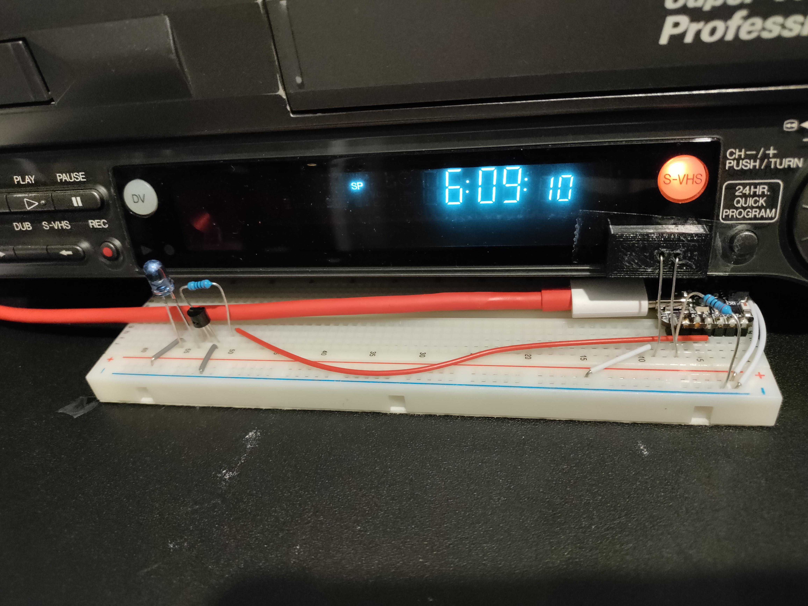
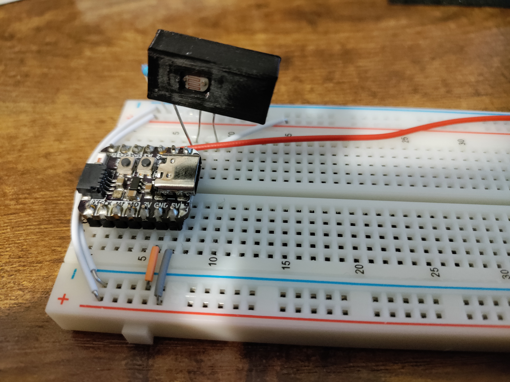
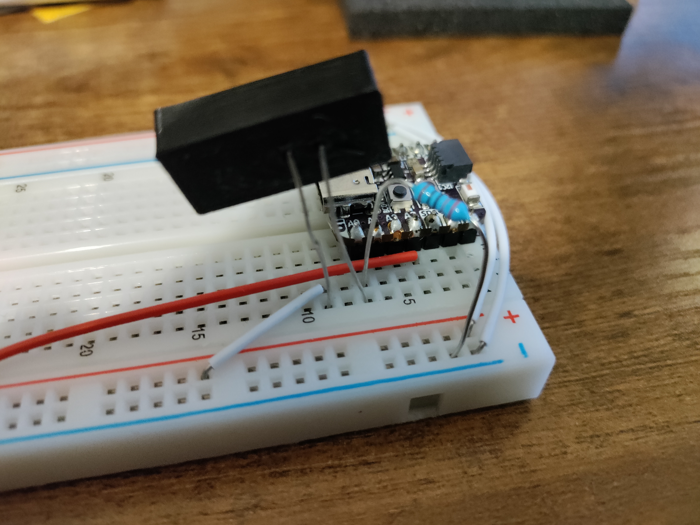
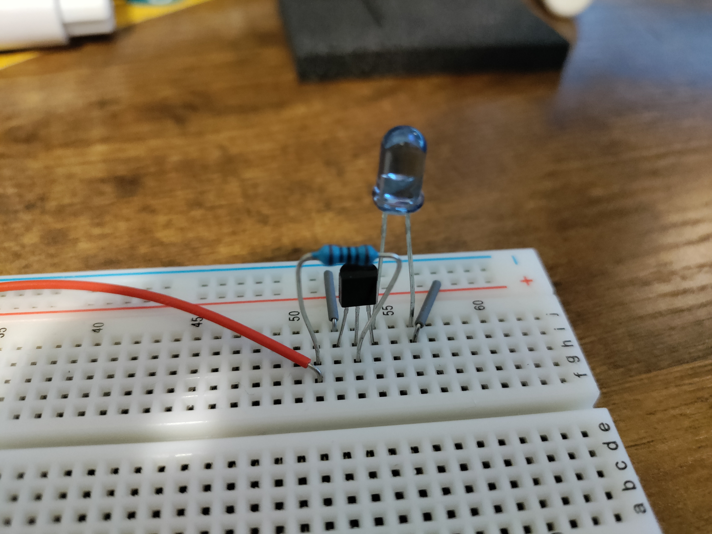

# Automatically Stop VirtualDub and VCR at the end of the VHS tape

This project uses an ESP32 to automatically start and stop VDub and a VCR at the same time by emulating a keyboard and remote control. It automatically stops when the tape finishes. The motiviation for this it to prevent VDub from recording unnecessarily long and reducing the wear and tear from rewinding.

I've only tested it on my JVC SR-VS30 VCR. It has a dedicated "playing" light on the front of the VCR which can be read by a photoresistor sensor. Other types of sensors maybe be need for VCRs that indicate it is playing in some other way.

In the demo video below the tape plays for 30 seconds before reaching the end of the tape and automatically stopping.

<video src="imgs/sample_video.mp4" controls="controls" style="max-width: 730px;">
</video>

## Part list
- ESP32-S2 (https://www.adafruit.com/product/5325 ESP32-S3 or other microcontrollers could work as well)
- Photoresistor https://www.adafruit.com/product/161
- 2N2222A transitor
- IR LED (https://www.adafruit.com/product/388)
- 220 ohm Resistor
- 100 ohm Resistor
- Breadboard / Jumper cables
- Optional - 3D printer to print photoresistor enclosure (stl file in repo).

## Overview

This devices works as follows:
1. Press "BOOT" button on ESP32. LED turns blue.
1. F5 is sent on the emulated keyboard to start VDub recording and IR LED sends code for "Play".
1. Wait for "play" light to come on. When on, the LED turn green.
1. Wait for "play" light to turn off. When light is off, send "ESC" to VDub and send IR code for "Stop". The LED turns red.

## Software

The needed libraries are already in the "libraries" folder. Open "stop_at_end/stop_at_end.ino" in the Arduino IDE (https://www.arduino.cc/en/software).

You may need to calibrate the `LIGHT_THRESHOLD` for your device. You may need to change the IR codes `kJVCPlay` and `kJVCStop` for your device as well.

Flash the firmware to the device using the Arduino IDE.

## Hardware

I don't have time at the moment to do a proper schematic, but pictures below should be sufficient to get you most of the way there. First, the image below is the final product. The images are high resolution so opening them in another tab may help.

### Connect Photo Resistor

The photo resistor needs an enclosure as to not be affected by outside light. Some kind of putty/clay may work as well.

One end of the photoresistor connects to the ESP32 pin A3. I used clear double-sided tape to keep it over the VCR's "play" LED. I connected the 220 ohm resistor to the A3 pin and to ground.

### Connect IR LED

The IR LED is powered by the 5v from the board. The transitor middle pin connects to the ESP32 pin A3 though the 100 ohm resistor.

